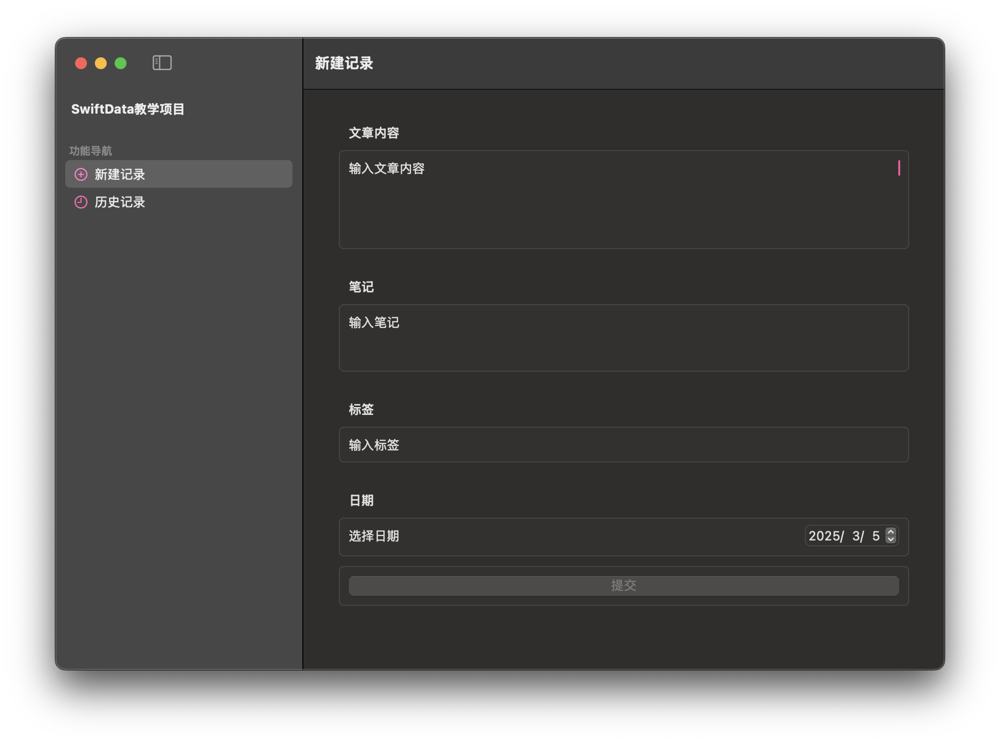
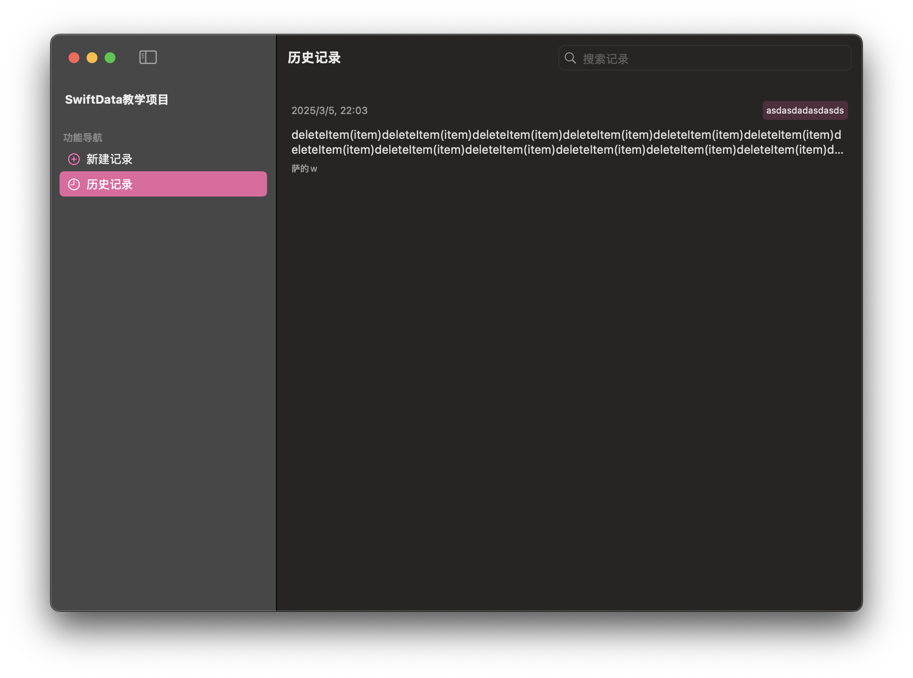
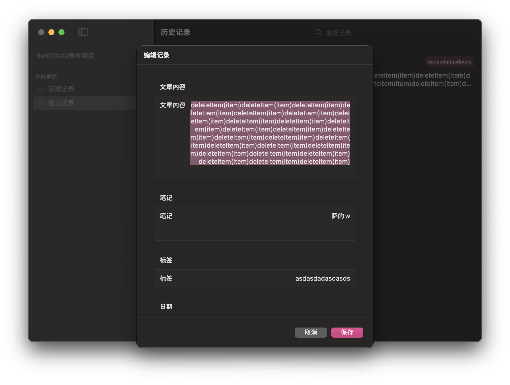

# SwiftDataTest

这是一个用于学习和练习SwiftData数据库的示例项目。项目展示了如何使用SwiftData进行数据存储、检索、更新和删除操作，同时结合SwiftUI构建用户界面。

## Demo




## 项目结构 
```
SwiftDataTest/
├── ContentView.swift # 主界面
├── HistoryView.swift # 历史记录查看界面
├── NewItemView.swift # 新建记录界面
├── EditItemView.swift # 编辑记录界面
├── Item.swift # 数据模型定义
└── SwiftDataTestApp.swift # 应用入口
```

## 快速开始

1. 克隆本仓库
   ```bash
   git clone https://github.com/yourusername/SwiftDataTest.git
   ```

2. 打开项目
   - 使用Xcode打开`SwiftDataTest.xcodeproj`

3. 运行项目
   - 选择目标设备（建议使用macOS）
   - 点击运行按钮（⌘R）

## 主要功能使用说明

### 新建记录
- 点击"新建记录"按钮，通过快捷键“⌘⇧N”打开
- 填写文章内容、笔记和标签
- 点击"提交"保存

### 查看历史记录，通过快捷键“⌘⇧C”打开
- 在侧边栏选择"历史记录"
- 使用搜索框查找特定记录
- 右键点击记录可进行编辑或删除

### 编辑记录
- 在历史记录视图中右键点击记录
- 选择"编辑"
- 修改内容后点击"保存"

### 删除记录
- 单个删除：右键点击记录，选择"删除"
- 批量删除：选择多个记录，点击工具栏的"删除选中"按钮

## 致谢
感谢bilibili教程：[Swift编程小马的视频](https://www.bilibili.com/video/BV1Pp1oYsETk)
